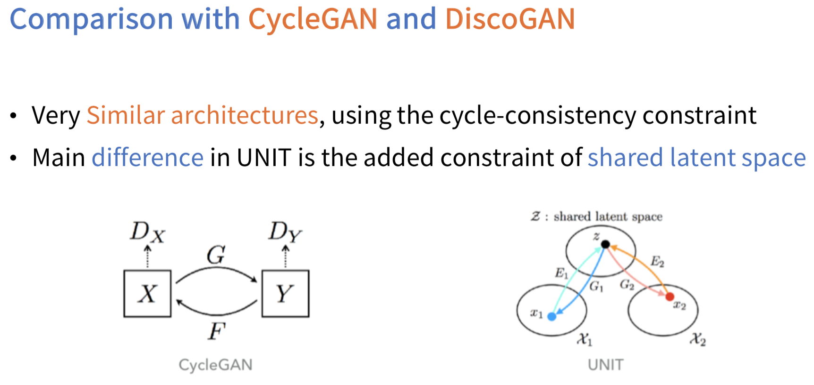
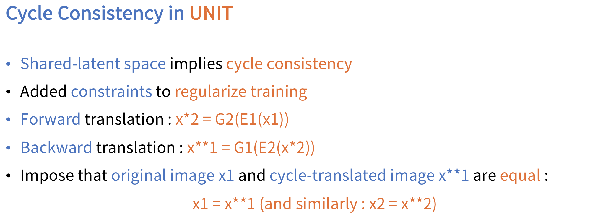

# UNIT-Tensorflow
Simple Tensorflow implementation of ["Unsupervised Image to Image Translation Networks"](https://arxiv.org/abs/1703.00848) (NIPS 2017 Spotlight)

## Requirements
* Tensorflow 1.4
* Python 3.6

## Usage
```bash
├── dataset
   └── YOUR_DATASET_NAME
       ├── trainA
           ├── xxx.jpg (name, format doesn't matter)
           ├── yyy.png
           └── ...
       ├── trainB
           ├── zzz.jpg
           ├── www.png
           └── ...
       ├── testA
           ├── aaa.jpg 
           ├── bbb.png
           └── ...
       └── testB
           ├── ccc.jpg 
           ├── ddd.png
           └── ...
```

```bash
> python main.py --phase train --dataset cat2tiger
```
* See `main.py` for other arguments
* If you want to `multi_gpu_version`, then use `main_multi_gpu.py` (batch_size = The batch_size per gpu)
* If you want to `faster_UNIT`, then use `DatasetAPI` (code is more simple !)

## Issue
### Too much Slow !!!
* The slower reason is that it stores checkpoints
* If you want to speed up, do not save checkpoints per iteration

## Arichitecture


## Framework


## Model





## Training Objective


## Result
### Success


### Fail


## Related works
* [CycleGAN-Tensorflow](https://github.com/taki0112/CycleGAN-Tensorflow)
* [DiscoGAN-Tensorflow](https://github.com/taki0112/DiscoGAN-Tensorflow)
* [MUNIT-Tensorflow](https://github.com/taki0112/MUNIT-Tensorflow)
* [StarGAN-Tensorflow](https://github.com/taki0112/StarGAN-Tensorflow)

## Reference
* [UNIT-Pytorch](https://github.com/mingyuliutw/UNIT)
* [Multi-GPU-Tensorflow](https://github.com/golbin/TensorFlow-Multi-GPUs)
* [DatasetAPI-Tensorflow](https://github.com/taki0112/Tensorflow-DatasetAPI)

## Author
Junho Kim
